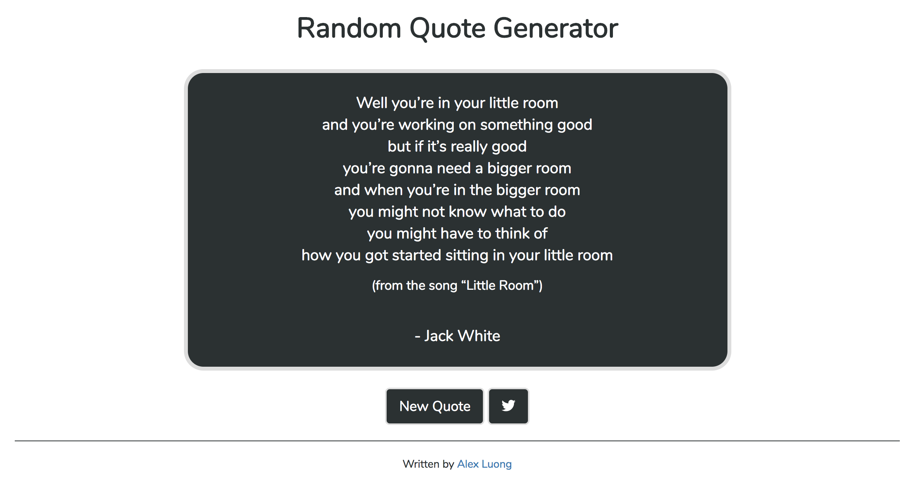

# Random Quote Generator
Fetches and displays a random quote from https://quotesondesign.com via an AJAX request. The request fetches 40 quotes at a time.
Idea came from a freeCodeCamp [challenge](https://www.freecodecamp.org/challenges/build-a-random-quote-machine). 

## Technologies Used
* HTML
* CSS
* Javascript
* jQuery
* Bootstrap 4

## Preview

## Acknowledgments
* Coding was done on [Thimble by Mozilla](https://thimble.mozilla.org/)
